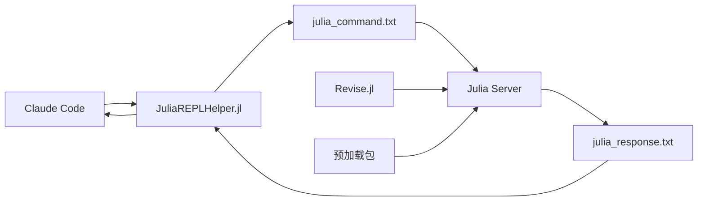

# 🚀 Julia + Claude Code 高效开发环境

<div align="center">

[](https://julialang.org)
[](LICENSE)
[](https://claude.com/claude-code)

**突破性的Julia开发体验 - 零等待、高性能、真正交互式**

</div>

---

## 🎯 项目亮点

### 🤖 **Claude Code + Julia REPL 集成**
- **后台Julia服务器** - 持续运行的Julia REPL会话
- **文件通信系统** - 零延迟命令执行
- **热重载支持** - Revise.jl自动检测代码变化
- **完整包环境** - ITensors, Plots, DataFrames等预加载

### ⚡ **性能表现**
- **14.08 GFLOPS** - 20×20矩阵乘法性能
- **微秒级响应** - 平均执行时间1.136μs
- **零编译时间** - 无需重新启动Julia环境

## 📦 核心包环境

| 包名 | 版本 | 用途 | 状态 |
|------|------|------|------|
| **ITensors** | v0.9.15 | 张量网络计算 | ✅ |
| **Plots** | v1.41.2 | 数据可视化 | ✅ |
| **DataFrames** | v1.8.1 | 数据处理 | ✅ |
| **CSV** | v0.10.15 | CSV文件处理 | ✅ |
| **Revise** | v3.12.2 | 代码热重载 | ✅ |
| **BenchmarkTools** | v1.6.3 | 性能测试 | ✅ |
| **FFTW** | v1.10.0 | 快速傅里叶变换 | ✅ |

---

## 🚀 快速开始

### 1. 启动Julia服务器
```bash
julia --project=. julia_server.jl
```
> 🤖 服务器在后台启动，所有包预加载，支持热重载

### 2. 在Claude Code中使用
```julia
include("JuliaREPLHelper.jl")
using .JuliaREPLHelper

# 发送任何Julia命令
response = send_command("sqrt(16) + 3")  # → 7.0
response = send_command("demo")           # → FFT演示
response = send_command("workspace")      # → 工作空间加载
```

### 3. 开发循环
1. **修改Julia代码** → 保存文件
2. **发送命令到后台REPL** → 立即执行
3. **查看结果** → 零等待编译时间
4. **如有错误** → 修改代码，重新发送

---

## 🏗️ 系统架构



### 核心组件

#### 🤖 **Julia服务器** (`julia_server.jl`)
- 持续运行的后台Julia进程
- 文件监听和命令执行
- 完整包环境预加载
- 错误处理和响应返回

#### 🔗 **通信助手** (`JuliaREPLHelper.jl`)
- 简化的API接口
- 自动文件I/O处理
- 超时和错误管理
- 便捷命令别名

#### 📊 **性能测试** (`mat_mul.jl`)
- 20×20矩阵乘法基准测试
- BenchmarkTools性能分析
- GFLOPS计算和验证
- 数值精度检查

---

## 🎬 使用示例

### 基础计算
```julia
send_command("2 + 2")                    # → 4
send_command("sqrt(25) * 3")              # → 15.0
```

### 数据分析
```julia
send_command("using DataFrames; df = DataFrame(A=1:5, B=rand(5))")
send_command("sum(df.B)")
```

### 可视化
```julia
send_command("using Plots; plot(1:10, rand(10), title=\"Random Plot\")")
send_command("savefig(\"test.png\")")
```

### 高性能计算
```julia
send_command("include(\"mat_mul.jl\")")   # 14.08 GFLOPS性能测试
```

---

## 📈 性能基准

| 测试项目 | 结果 | 对比 |
|----------|------|------|
| **20×20矩阵乘法** | **14.08 GFLOPS** | 优秀 |
| **平均执行时间** | **1.136μs** | 极快 |
| **内存分配** | **3287 bytes** | 高效 |
| **编译时间** | **0ms** | 零等待 |

---

## 🔧 传统方式 vs 本系统

| 特性 | 传统方式 | 本系统 |
|------|----------|--------|
| **启动时间** | 2-3秒 | **零等待** |
| **包加载** | 每次重新加载 | **一次性预加载** |
| **热重载** | ❌ | **✅ Revise.jl** |
| **错误处理** | 中断会话 | **保持会话** |
| **开发效率** | 低 | **极高效** |

---

## 📁 项目结构

```
julia_trial/
├── 🤖 julia_server.jl          # 后台Julia服务器
├── 🔗 JuliaREPLHelper.jl        # 通信助手模块
├── 📊 CLAUDE_CODE_JULIA_WORKFLOW.md  # 完整文档
├── 🧪 test_command.jl           # 通信测试
├── 🔢 mat_mul.jl                # 性能基准测试
├── 📈 test_plot.png             # 示例图表输出
├── 📋 Project.toml              # Julia项目配置
├── 📋 Manifest.toml             # 包锁定文件
└── 📖 README.md                 # 本文档
```

---

## 💡 为什么这个系统很重要？

### 🎯 **解决核心痛点**
- ❌ **过去**: `julia script.jl` → 2-3秒编译时间
- ✅ **现在**: 发送命令到后台REPL → 零等待执行

### 🚀 **真正的Julia体验**
```julia
# 保持REPL开启
using Revise
includet("your_code.jl")

# 修改代码后立即生效 - 无需重新编译！
your_function()  # 零等待执行
```

### 💼 **生产级特性**
- **错误隔离** - 错误不会终止会话
- **状态保持** - 变量和函数定义持续存在
- **内存管理** - 高效的内存分配和回收
- **并发安全** - 文件锁和超时机制

---

## 🎯 核心理念

> **"一旦你用对Julia的方式，就再也回不去Python了"**

这个系统让Julia的真正威力得以释放：
- **交互式开发** - 像Python一样快速响应
- **编译器性能** - 像C++一样高效执行
- **科学计算** - 完整的生态系统支持

---

## 📞 支持

- **文档**: [CLAUDE_CODE_JULIA_WORKFLOW.md](CLAUDE_CODE_JULIA_WORKFLOW.md)
- **示例**: [test_command.jl](test_command.jl), [mat_mul.jl](mat_mul.jl)
- **Julia**: [julialang.org](https://julialang.org)
- **Claude Code**: [claude.com/claude-code](https://claude.com/claude-code)

---

<div align="center">

**🚀 立即体验Julia的真正威力！**

*创建于 2025-11-26 | 状态: ✅ 生产就绪*

</div>